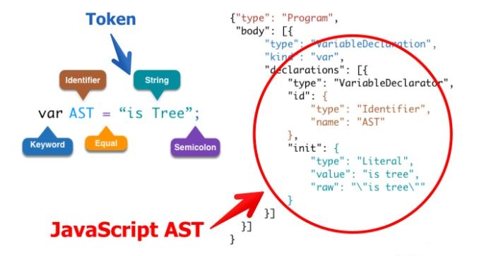

### 1.抽象语法树(Abstract Syntax Tree)

- 抽象语法树（Abstract Syntax Tree，AST）是源代码语法结构的一种抽象表示
- 它以树状的形式表现编程语言的语法结构，树上的每个节点都表示源代码中的一种结构

### 2.抽象语法树用途

- 代码语法的检查、代码风格的检查、代码的格式化、代码的高亮、代码错误提示、代码自动补全等等
- 优化变更代码，改变代码结构使达到想要的结构

### 3.抽象语法树定义

- 这些工具的原理都是通过 JavaScript Parser 把代码转化为一颗抽象语法树（AST），这颗树定义了代码的结构，通过操纵这颗树，我们可以精准的定位到声明语句、赋值语句、运算语句等等，实现对代码的分析、优化、变更等操作
  

### 4. JavaScript Parser

`JavaScript Parser` 是把 JavaScript 源码转化为抽象语法树的解析器

#### 4.1 常用的 JavaScript Parser

- SpiderMonkey
  - estree
    - esprima
    - acorn
      - babel parser

#### 4.2 AST 节点

#### 4.3 AST 遍历

- [astexplorer](https://astexplorer.net/)
- AST 是深度优先遍历

```js
let esprima = require("esprima"); //把JS源代码转成AST语法树
let estraverse = require("estraverse"); ///遍历语法树,修改树上的节点
let escodegen = require("escodegen"); //把AST语法树重新转换成代码
let code = `function ast(){}`;
let ast = esprima.parse(code);
let indent = 0;
const padding = () => " ".repeat(indent);
estraverse.traverse(ast, {
  enter(node) {
    console.log(padding() + node.type + "进入");
    if (node.type === "FunctionDeclaration") {
      node.id.name = "newAst";
    }
    indent += 2;
  },
  leave(node) {
    indent -= 2;
    console.log(padding() + node.type + "离开");
  },
});
```
